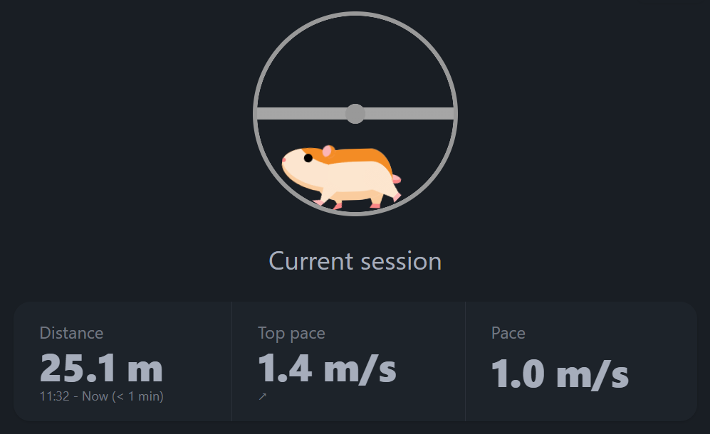
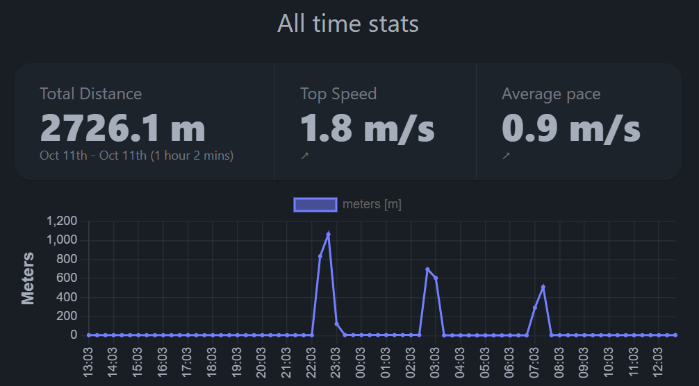

<div align="center">
  <h1>

    Hamster - Pedometer 🐹💨👟

  </h1>

<h4>Ever wondered how long your hamster is running?</h4>

<p>
  <a href="#overview">Overview</a> •
  <a href="#features">Key Features</a> •
  <!-- <a href="#getting-started">Documentation</a> • -->
  <a href="#credits">Credits</a> •
  <a href="#license">License</a>
</p>

[](https://github.com/runeharlyk/SpotMicroESP32-Leika/actions/workflows/frontend-tests.yml)
[](https://github.com/runeharlyk/SpotMicroESP32-Leika/actions/workflows/embedded-build.yml)

</div>
<!-- GIF  -->

## 📜 Overview

This project aim to track hamsters routine, health and running stats.
Built on an ESP32 with an external hall effect sensor and a couple of small magnets, it aims to be both affordable and accessible.

## 🎯 Features

- **Real-Time Data**: Get real-time updates of your hamsters activities.
- **Statistical analysis**: See statistical data.
- **Nice UI**: Beatify, responsive UI.
- **Highly customizable**
- **Simple setup**: Flash the device and start your tracking journey.
<!-- - **Notification**: Get weekly overview with push notifications. -->

## 🐹 Live hamster feed



### 📈 Statistics



<!-- ### 🛠️ Documentation -->

## 🔮 Getting started

1. Clone and open the new project

   ```sh
   git clone https://github.com/runeharlyk/hamster-pedometer
   ```

1. Install dependencies with preferable package manager (npm, pnpm, yarn)

   ```sh
   cd app
   pnpm install
   ```

1. Configure device settings

   1. Update `factory_settings.ini` with relevant settings

1. Upload filesystem image using platformIO

1. Upload firmware using platformIO

## 🚀 Future

See the [open issues](https://github.com/runeharlyk/hamster-pedometer/issues) for full list of proposed and active features (and known issues).

## 🙌 Credits

This project takes great inspiration from the following resources:

1. [Spot Micro - Leika](https://github.com/runeharlyk/SpotMicroESP32-Leika)

## ☕ Support

If you like the project and want to follow it evolving concidering ✨-ing the project

<a href="https://bmc.link/runeharlyk" target="_blank"></a>

<!-- ## You may also like... -->

## 📃 License

[MIT](LICENSE.md)

---

> [runeharlyk.dk](https://runeharlyk.dk) &nbsp;&middot;&nbsp;
> GitHub [@runeharlyk](https://github.com/runeharlyk) &nbsp;&middot;&nbsp;
> LinkedIn [@Rune Harlyk](https://www.linkedin.com/in/rune-harlyk/)
